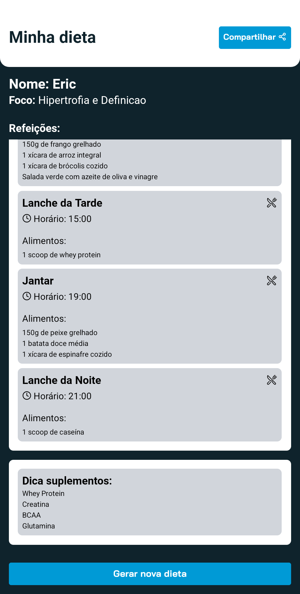

# Dieta.AI - Aplicativo Mobile


Este é o aplicativo mobile Dieta.AI, desenvolvido com Expo e React Native. O Dieta.AI utiliza inteligência artificial para gerar dados personalizados para uma dieta, baseando-se nas informações fornecidas pelo usuário.

## Tecnologias Principais

- Expo
- React Native
- TypeScript
- NativeWind (TailwindCSS para React Native)
- React Query
- Zustand
- React Hook Form
- Zod
- Axios

## Pré-requisitos

Certifique-se de ter o Node.js e o npm instalados em sua máquina.

## Instalação

1. Clone o repositório

   ```bash
    git clone https://github.com/ericrocha97/dieta-ai-mobile.git
    ```

2. Navegue até a pasta do projeto

   ```bash
    npm dieta-ai-mobile
    ```

3. Instale as dependências:

   ```bash
    npm install
    ```

## Comandos para Executar

- Iniciar o projeto:

  ```bash
  npm start
  ```

- Executar no Android:

  ```bash
  npm run android
  ```

- Executar no iOS:

  ```bash
  npm run ios
  ```

## Configurações Adicionais

- Este projeto utiliza fontes personalizadas do Google Fonts (Bai Jamjuree e Roboto).
- Está configurado para usar o Expo Router para navegação.
- Utiliza o NativeWind para estilização baseada em Tailwind CSS.
- Configurado com React Query para gerenciamento de estado e requisições.
- Usa Zustand para gerenciamento de estado global.
- Implementa validação de formulários com React Hook Form e Zod.

## Estrutura do Projeto

O projeto segue a estrutura padrão de um aplicativo Expo, com algumas pastas adicionais:

- `src/app`: Contém as telas principais do aplicativo
- `src/components`: Componentes reutilizáveis
- `src/styles`: Arquivos de customização do Tailwind (cores, fontes)
- `src/store`: Gerenciamento de estado global com Zustand
- `src/services`: Serviços para comunicação com API

## Capturas de Tela

Aqui estão algumas capturas de tela do aplicativo Dieta.AI:

<div style="display: flex; justify-content: space-around;">
  
  
  

</div>
<div style="display: flex; justify-content: space-around; margin-top: 20px;">
  
  
</div>
